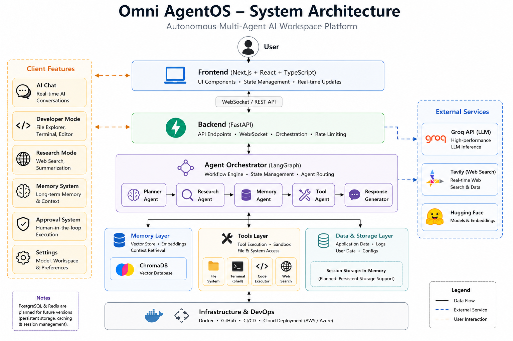
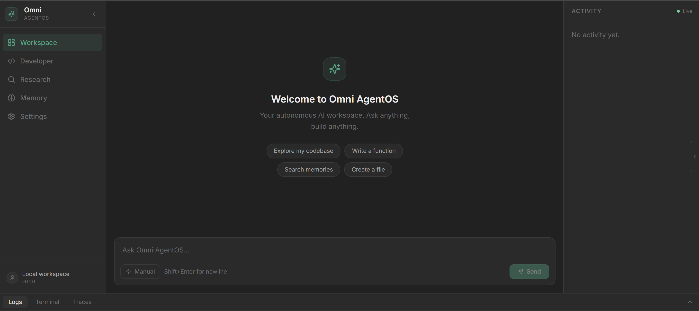
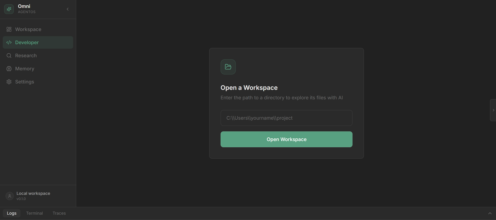
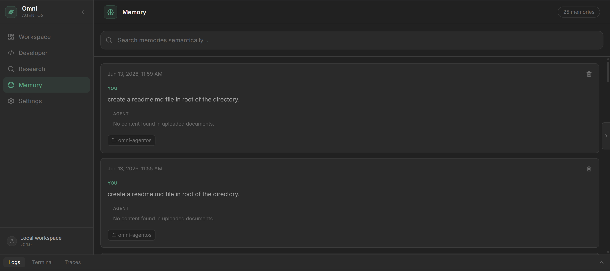
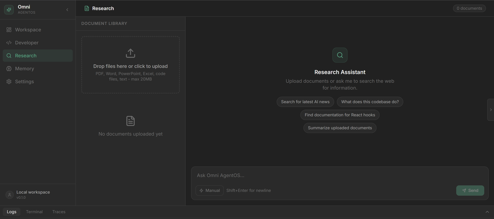
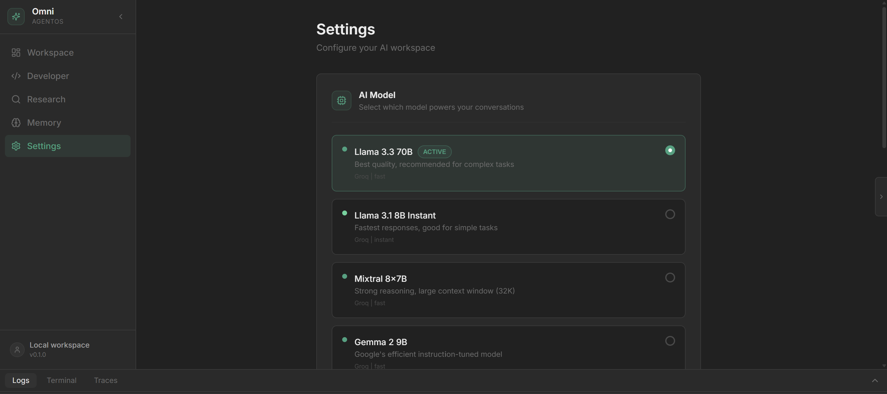

# Omni AgentOS


> Agentic AI Workspace Platform featuring RAG, Memory, Research, Developer Tools, and Autonomous Workflows.



## Overview

Omni AgentOS is a full-stack AI workspace designed to combine conversational AI, semantic memory, document research, developer tooling, and agentic workflows into a unified platform.

The system integrates Large Language Models (LLMs), Retrieval-Augmented Generation (RAG), vector memory, real-time streaming, web research, and workspace-aware developer tools to create an AI operating environment capable of assisting with coding, research, and knowledge management tasks.

---

## Key Features

### AI Chat
- Real-time token streaming
- Context-aware conversations
- Multi-turn memory support
- Markdown and code rendering

### Developer Mode
- Repository exploration
- File reading and writing
- Workspace-aware AI assistance
- Terminal command execution

### Memory System
- ChromaDB vector storage
- Semantic memory retrieval
- Long-term conversational memory
- Memory search and management

### Research Mode
- Web search integration
- Document upload and ingestion
- Contextual retrieval
- Research-focused AI workflows

### Agent Framework
- LangGraph orchestration
- Tool calling
- Workspace awareness
- Human-in-the-loop architecture

---

## System Architecture


### Core Components

| Component | Purpose |
|------------|----------|
| Next.js Frontend | User interface and workspace |
| FastAPI Backend | API and orchestration layer |
| LangGraph | Agent execution framework |
| Groq LLM | Language model inference |
| ChromaDB | Vector memory storage |
| Sentence Transformers | Embedding generation |
| Tavily | Web research capabilities |
| WebSockets | Real-time communication |

---

## Screenshots

### Main Workspace



### Developer Mode



### Memory System



### Research Mode



### Settings



---

## Tech Stack

### Frontend

- Next.js 15
- React
- TypeScript
- Tailwind CSS
- Zustand
- Framer Motion

### Backend

- FastAPI
- LangGraph
- WebSockets
- Pydantic

### AI & ML

- Groq
- ChromaDB
- Sentence Transformers
- RAG Pipelines
- Semantic Search

### DevOps

- Docker (Planned)
- CI/CD (Planned)
- GitHub

---

## Project Structure

```text
backend/
frontend/
docs/
├── architecture/
├── diagrams/
└── screenshots/
```

---

## Roadmap

### Completed

- AI Chat
- Streaming Responses
- Developer Mode
- Tool Calling
- Memory System
- Semantic Search
- RAG
- Research Mode
- Settings Management

### In Progress

- Human-in-the-Loop Execution
- Approval Workflow System

### Planned

- Multi-Agent Orchestration
- ONNX-based Local Intent Classifier
- ONNX Inference Runtime
- Repository Intelligence
- Knowledge Graph Memory
- Docker Deployment

---

## Author

**Devraj Singh**

Portfolio:
https://devraj-singh.vercel.app/

GitHub:
https://github.com/Devrajji-Singh

LinkedIn:
https://linkedin.com/in/devraj-s/

---

## License

MIT License
